<p align="center">
  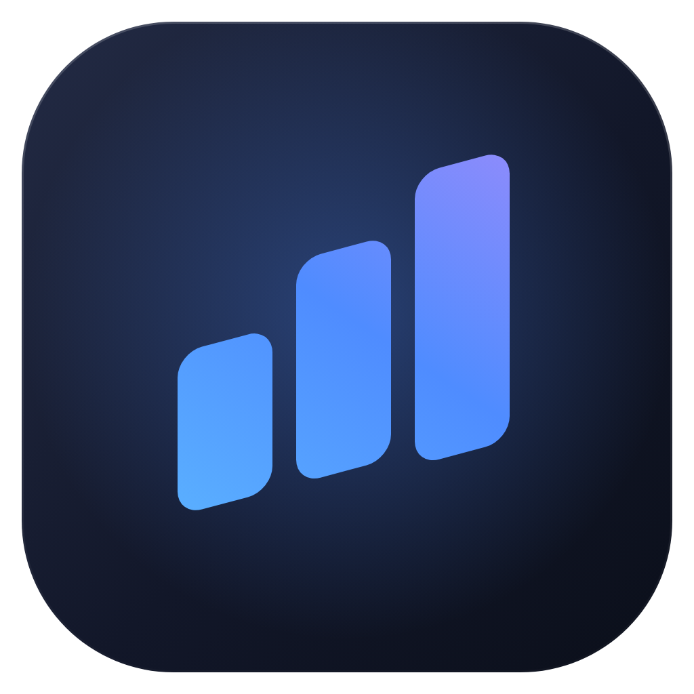
</p>

<h1 align="center">Investa</h1>

<p align="center">
  Aplicativo para Windows e Android que ensina a investir do zero.<br>
  Aulas de poucos minutos, cotações do dia, controle de gastos e faturas e um assistente de IA que responde com base na sua carteira.
</p>

<p align="center">
  <a href="https://github.com/brunoosz/app/releases/latest"></a>
  <a href="https://github.com/brunoosz/app/releases/latest"></a>
</p>

<p align="center">
  <a href="https://github.com/brunoosz/app/releases/latest"></a>
  <a href="https://github.com/brunoosz/app/actions/workflows/build.yml"></a>
</p>

<picture>
  <source media="(prefers-color-scheme: dark)" srcset="docs/media/capa-escuro.png">
  <source media="(prefers-color-scheme: light)" srcset="docs/media/capa-claro.png">
  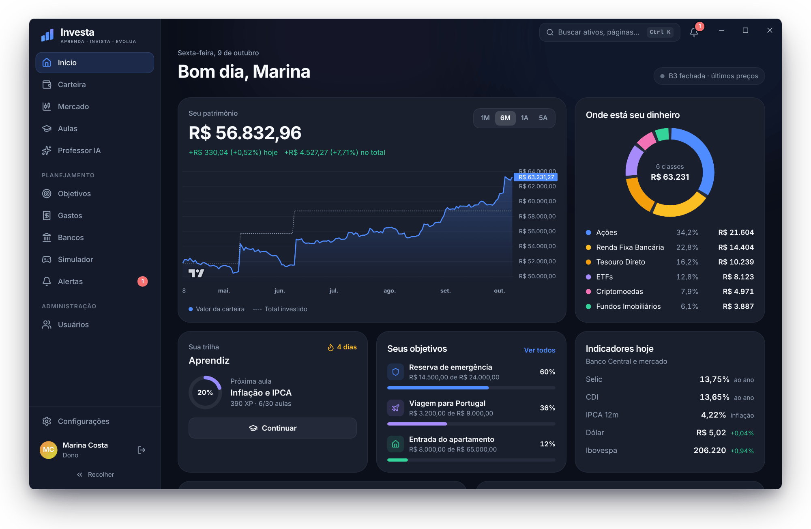
</picture>

Você informa quanto ganha e quanto gasta e cadastra o que já tem investido. Com isso, o app mostra quanto a carteira rende, quanto falta para cada meta e qual é a próxima aula. As cotações vêm do Yahoo Finance, os títulos públicos, do Tesouro Direto, e os juros e a inflação, do Banco Central. Contas e dados ficam no seu aparelho. Só as perguntas ao Assistente saem dele, junto com os dados que a IA usa para responder.

O conteúdo é educativo e não é recomendação de investimento.

## Mercado

A tela Mercado tem 11 categorias: ações brasileiras e americanas, FIIs, ETFs, BDRs, Tesouro Direto, renda fixa bancária, cripto, moedas, índices e commodities. Cada ativo com cotação tem gráfico de linha ou de candles, de 1 dia até o histórico completo, com médias de 50 e 200 dias e, quando o Yahoo Finance informa, P/L e dividend yield.

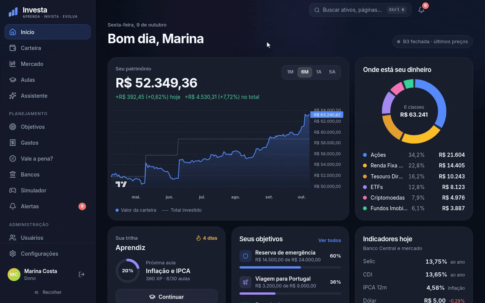

## Aulas

São 30 aulas em 10 módulos, de "o que é investir" até montar uma carteira, imposto de renda e como se proteger de golpes. Cada aula termina com um quiz de três perguntas. As respostas certas valem XP, e é preciso acertar as três para liberar a próxima aula.

<p align="center">
  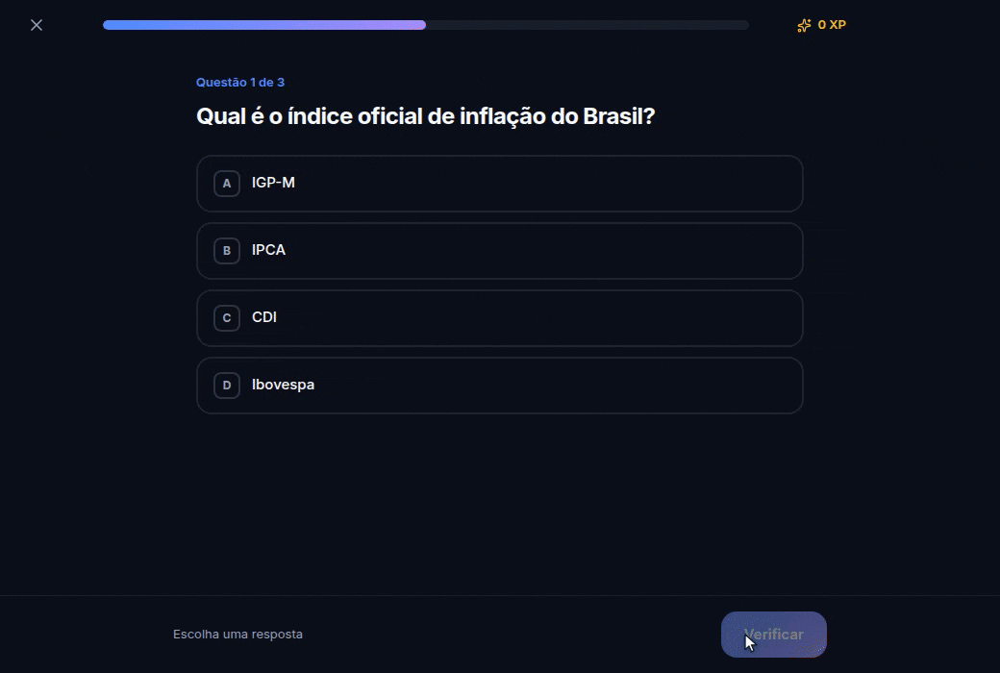
</p>

## Gastos, faturas e metas

Lance os gastos do mês por categoria e cartão, inclusive compras parceladas, e informe quanto veio a fatura de cada banco. Quando as faturas passam da renda, o app avisa, e o botão "Pedir ajuda ao Assistente" monta um plano para pagar sem se endividar, comparando parcelar a fatura, empréstimo e o rotativo com os juros reais do Banco Central. O mês pode ser exportado em PDF ou Excel, com uma análise escrita pelo Assistente se você quiser.

Cada meta tem valor e prazo. Com o CDI e o IPCA de hoje, o app projeta quanto você terá no fim do prazo e, se não for suficiente, quanto precisa aplicar por mês. Para a parte aplicada em CDB, LCI ou LCA, também mostra quanto você teria em outros bancos.

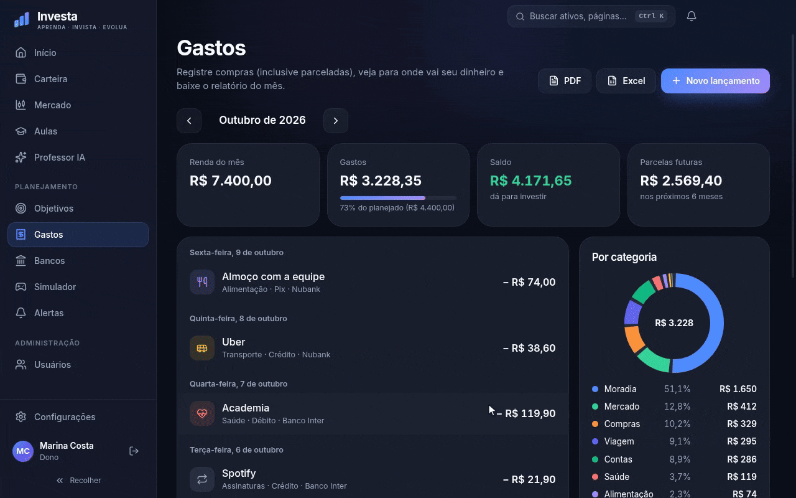

## Assistente

O Assistente conversa em seis modos. Cada um recebe só os dados de que precisa.

| Modo | Para quê |
|---|---|
| Conversa livre | Qualquer assunto, como um chat de IA comum |
| Professor | Explica investimentos passo a passo, com exemplos e perguntas no fim |
| Minhas finanças | Orçamento, faturas e dívidas, com os seus números |
| Analista de mercado | Cotações, Selic, notícias e a sua carteira em tempo real |
| Vale a pena comprar? | Diz se o preço está bom e se a compra cabe no seu mês |
| Ajuda com o app | Explica onde fica cada coisa no Investa |

Ele usa os modelos de IA da NVIDIA. No modo Automático (o padrão), o app escolhe o melhor modelo disponível na sua conta e troca sozinho quando sai um melhor ou quando o atual é desativado.

## Vale a pena?

Cole o link de um produto ou jogo, ou escreva o nome. Para jogos, o app mostra o preço na Steam em reais, o desconto e o menor preço já registrado nas lojas de PC (Steam, Epic e outras). Para outras lojas, lê o preço da página. Em todos os casos, diz se a compra cabe no que sobra do seu mês, já descontando as faturas.

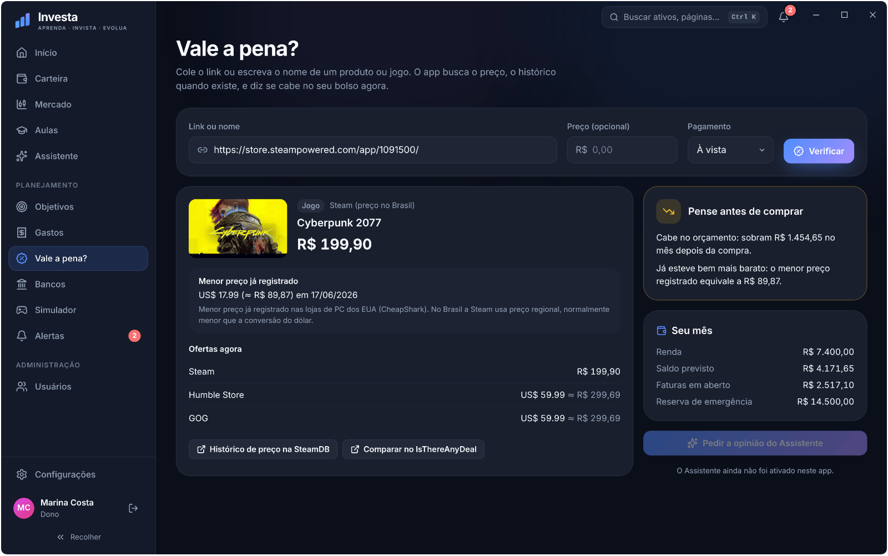

## No celular

O app Android tem as mesmas telas do Windows, com a navegação adaptada para o polegar.

<p align="center">
  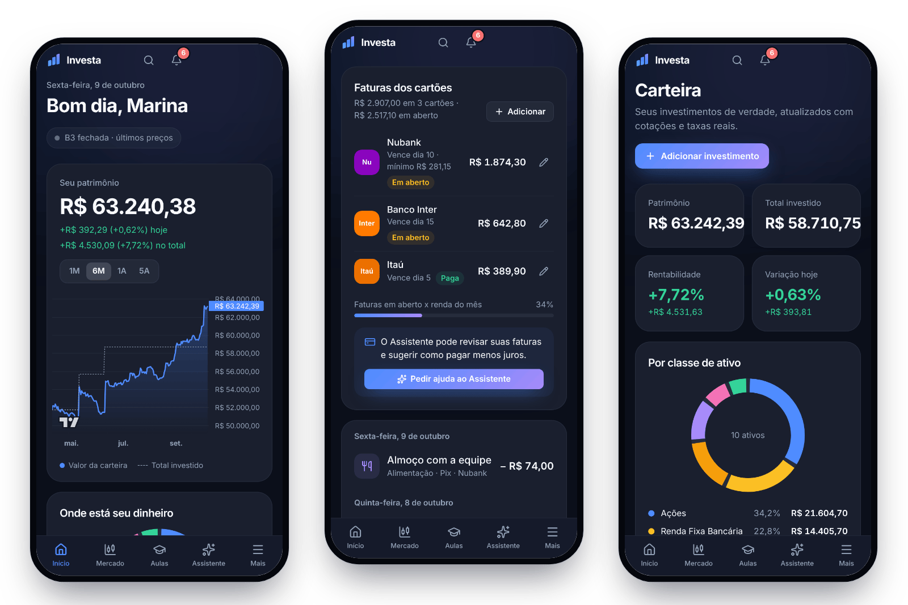
</p>

## Mais telas

<table>
  <tr>
    <td width="50%">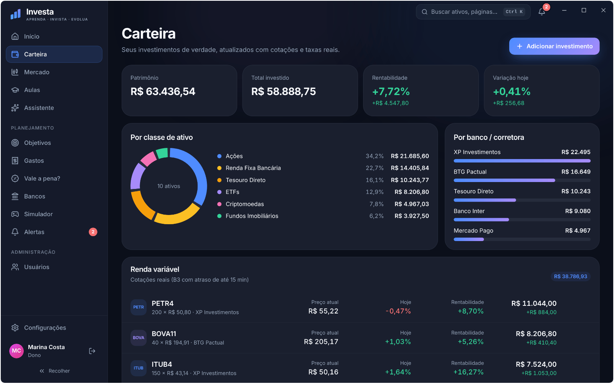<br><sub>Carteira dividida por classe de ativo e por banco</sub></td>
    <td width="50%">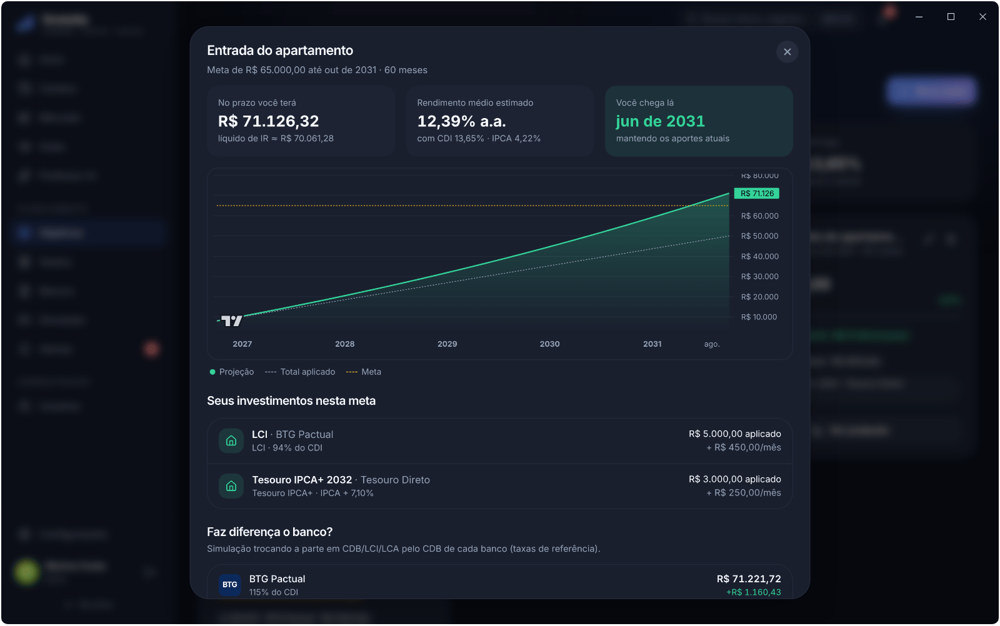<br><sub>Projeção de uma meta e comparação entre bancos</sub></td>
  </tr>
  <tr>
    <td>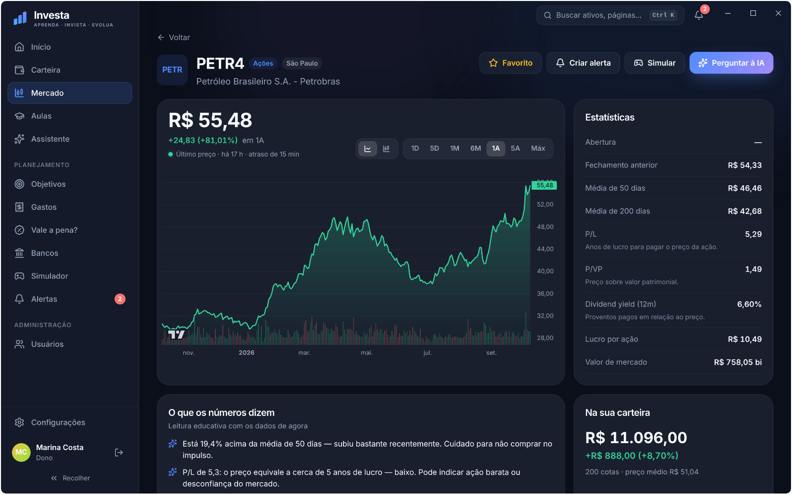<br><sub>Página de um ativo, com indicadores explicados</sub></td>
    <td>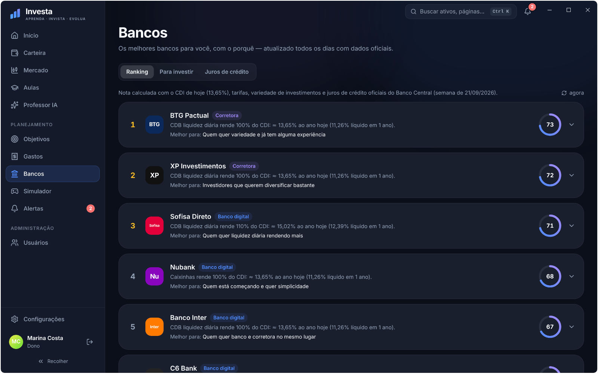<br><sub>Ranking de bancos com o motivo de cada nota</sub></td>
  </tr>
  <tr>
    <td>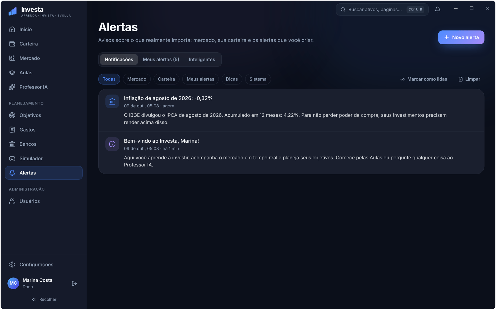<br><sub>Avisos automáticos sobre os ativos da carteira</sub></td>
    <td>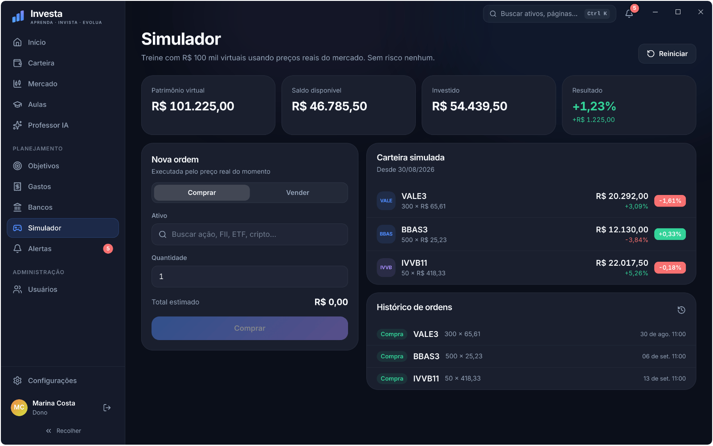<br><sub>Simulador com R$ 100 mil virtuais</sub></td>
  </tr>
</table>

<sub>As imagens usam uma conta de demonstração, com cotações, juros e indicadores reais do dia da captura.</sub>

## Download

A versão mais recente está em [Releases](https://github.com/brunoosz/app/releases/latest).

| Arquivo | Uso |
|---|---|
| `Investa-Setup-<versão>.exe` | Instalador. Deixa escolher a pasta e cria atalhos na área de trabalho e no menu Iniciar. |
| `Investa-Portatil-<versão>.exe` | Executável único que roda sem instalar. |
| `Investa-Android-<versão>.apk` | App para Android 7 ou mais novo. |

O executável não tem assinatura digital, então o Windows pode mostrar "O Windows protegeu o computador". Para abrir, clique em "Mais informações" e depois em "Executar assim mesmo".

No Android, baixe o `.apk` pelo celular e abra o arquivo. Na primeira vez, o sistema pede para permitir a instalação de apps vindos do navegador ou do gerenciador de arquivos. O app não está na Play Store. As versões novas instalam por cima da anterior sem perder os dados.

Não há versão pronta para iPhone, que exige uma conta paga de desenvolvedor da Apple. O `.dmg` e o `AppImage` podem ser gerados a partir do código (veja [Gerar instaladores](#gerar-instaladores)).

## Primeiro uso

1. Crie uma conta. A primeira conta criada recebe o cargo Dono, e as seguintes, feitas pela tela de cadastro, entram como Usuário. O Dono pode criar Administradores e outros Donos na tela Usuários.
2. Responda ao questionário: renda, gastos, quanto dá para investir, perfil de investidor e objetivo principal. Os dados financeiros podem ser alterados depois em Configurações.
3. Para ativar o Assistente, crie uma chave em [build.nvidia.com](https://build.nvidia.com/settings/api-keys), cole a chave (`nvapi-...`) em Configurações → Inteligência Artificial e clique em "Testar conexão". Só o Dono vê essa seção. A chave vale para todas as contas do aparelho, e no celular ela é configurada à parte.

Todo mundo entra pela mesma tela, só com usuário e senha. O cargo vem da conta e define o que aparece dentro do app: a tela Usuários, por exemplo, só existe para Dono e Administrador. Com "Manter conectado" ligado (é o padrão), a sessão fica salva por 30 dias e o login é pulado.

O Administrador gerencia só contas de Usuário, só o Dono muda cargos, e o app não deixa remover, rebaixar nem bloquear o último Dono.

## Todas as telas

| Tela | O que faz |
|---|---|
| Início | Gráfico do patrimônio, divisão da carteira, objetivos, indicadores do dia (Selic, CDI, IPCA 12m, dólar, Ibovespa), favoritos e notícias |
| Carteira | Renda variável (símbolo, quantidade, preço médio) e renda fixa (CDB, LCI, LCA, Tesouro, poupança, debênture) indexada a CDI, Selic, IPCA ou prefixada |
| Mercado | 11 categorias: 267 ativos com cotação em 9 delas, mais os títulos do Tesouro Direto e a renda fixa bancária. Tem busca no Yahoo Finance e favoritos. Cada ativo tem gráfico de linha ou candles de 1D a MAX, P/L, P/VP, dividend yield e médias de 50 e 200 dias |
| Aulas | 30 aulas em 10 módulos, do iniciante ao avançado, com quiz, XP, níveis, conquistas, ranking e um glossário de 45 termos |
| Assistente | Chat com seis modos que usa os indicadores do dia, cotações, notícias, títulos do Tesouro, juros de crédito e os dados do usuário (perfil, carteira, objetivos, gastos e faturas) |
| Objetivos | Metas com valor e prazo, projeção com CDI e IPCA atuais e, para a parte aplicada em CDB, LCI ou LCA, comparação entre bancos |
| Gastos | Lançamentos por categoria, forma de pagamento e banco, com parcelamento, e as faturas de cada cartão no mês. Exporta o mês em PDF ou Excel, com análise do Assistente opcional |
| Vale a pena? | Preço atual, desconto e histórico (jogos) de um produto ou jogo, e se a compra cabe no orçamento do mês |
| Bancos | Ranking de 14 bancos e corretoras com o motivo de cada nota, rendimento com o CDI do dia (líquido de IR) e juros de crédito informados pelo Banco Central |
| Simulador | R$ 100.000 virtuais para comprar e vender ativos a preços reais |
| Alertas | Preço acima ou abaixo de um valor, variação no dia, queda abaixo da média de 50 dias e lembretes com data e hora. Também ajusta os limites dos avisos automáticos da carteira |
| Usuários | Criar, editar, bloquear e excluir contas e redefinir senhas (só Dono e Administrador) |

As aulas são liberadas em sequência. A próxima só abre com pelo menos 70% no quiz. Como cada quiz tem 3 perguntas, na prática é preciso acertar todas.

### Avisos automáticos

Além dos alertas criados pelo usuário, o app avisa quando:

- um ativo de renda variável da carteira passa de 10% de lucro ou de prejuízo sobre o preço médio, ou fica 5% acima ou abaixo da média de 50 dias (os limites podem ser mudados na tela Alertas);
- há reunião ou decisão do Copom, ou divulgação do IPCA;
- o Ibovespa varia 1,5% ou mais no dia (a partir das 15h, horário de Brasília) ou o dólar varia 1% ou mais;
- as faturas em aberto do mês passam de 60% da renda ou da renda inteira.

Também mostra uma dica de educação financeira por dia.

Os alertas rodam só para a conta conectada e enquanto o app está aberto. No Windows, com a opção "Continuar em segundo plano" ligada (vem desligada), fechar a janela deixa o app na bandeja e os alertas continuam rodando. Com o app fora de foco, os avisos aparecem como notificação do sistema, se essa opção estiver ligada (vem ligada).

## Fontes de dados

| Dado | Fonte | Cache |
|---|---|---|
| Cotações | Yahoo Finance | 10 s |
| Gráficos | Yahoo Finance | de 30 s (1D) a 12 h (MAX), conforme o período |
| Selic, CDI, IPCA, PTAX, poupança, TR | Banco Central (SGS) | 30 min |
| Expectativas do Boletim Focus | Banco Central (API Olinda) | 6 h |
| Juros de crédito por banco | Banco Central (API Olinda, `taxaJuros`) | 12 h |
| Títulos públicos | JSON do Tesouro Direto, com o CSV do Tesouro Transparente como alternativa | 1 h em memória, 4 h em disco |
| Notícias | RSS de InfoMoney, Money Times, g1 Economia, Exame e CNN Brasil | 10 min |
| Preço de jogos | API da Steam (preço no Brasil) e CheapShark (menor preço histórico em lojas de PC) | 7 dias para a lista de lojas |
| Modelos de IA | Lista `/v1/models` da conta NVIDIA | 24 h |

Com a janela visível, a tela atualiza as cotações a cada 15 segundos. Segundo o Yahoo Finance, as cotações da B3 têm até 15 minutos de atraso, e as de cripto e câmbio são praticamente em tempo real.

## Configuração da IA

O Assistente usa a API da NVIDIA (`https://integrate.api.nvidia.com/v1`). Em Configurações → Inteligência Artificial, o Dono vê a lista de modelos de conversa da própria conta, lida da NVIDIA e atualizada todo dia, ordenada do mais indicado para o Investa ao menos indicado. Dá para fixar um modelo ou deixar em Automático.

No Automático, o app usa o melhor modelo disponível. Se um modelo for desativado pela NVIDIA (erro 404 ou 410), o app tenta o próximo da lista na mesma pergunta, passa a usá-lo e manda uma notificação ao Dono. Quem não é Dono não vê o nome do modelo nem mensagens técnicas: se a IA falhar, aparece só "O Assistente não está disponível agora", e o Dono recebe o detalhe nas notificações.

O app procura a chave nesta ordem:

1. a chave salva em Configurações;
2. um arquivo de configuração (só no Windows);
3. a variável de ambiente `NVIDIA_API_KEY` (só no Windows).

Para usar um arquivo, copie `config.example.json` para `config.json` e preencha a chave:

```json
{
  "nvidiaApiKey": "nvapi-...",
  "model": "auto"
}
```

Em cada pasta da lista abaixo, o app procura `config.json`, `investa.config.json` e `.env` (com a linha `NVIDIA_API_KEY=...`), nessa ordem. Vale o primeiro arquivo válido: JSON com erro e `.env` sem essa linha são ignorados.

1. pasta de dados do app;
2. pasta onde está o `.exe` portátil;
3. pasta do executável;
4. só no modo `--dev`, a pasta de onde o app foi iniciado (a raiz do projeto, com `npm run electron:dev`).

O arquivo também aceita os campos `apiKey` e `baseUrl`. Do `.env`, o app lê só a chave. O modelo escolhido em Configurações tem prioridade sobre o do arquivo. A tela não tem campo para a URL, então outra API compatível com a da OpenAI (com `/chat/completions` em streaming) só pode ser usada pelo campo `baseUrl` do arquivo. Todos esses nomes de arquivo estão no `.gitignore`.

## Dados locais

No Windows, os dados ficam na pasta `userData` do Electron (`%APPDATA%\Investa`), e a tela Configurações → Sobre mostra a pasta em uso. No Android, ficam no armazenamento interno do app e são apagados se o app for desinstalado.

- `investa-data.json` guarda as contas, os dados de cada usuário, as notificações, as configurações, a sessão salva e a chave da IA. As senhas são salvas com scrypt e um salt próprio para cada usuário. O app grava primeiro em um `.tmp` e depois renomeia, para o arquivo não ficar pela metade se o app fechar no meio da gravação.
- `investa-data.bak.json` é uma cópia feita sempre que o app abre. Se o arquivo principal estiver corrompido, ele é renomeado para `investa-data.corrompido-<timestamp>.json` e o app tenta recuperar os dados dessa cópia.
- `cache-tesouro.json` e `cache-credito.json` guardam a última consulta ao Tesouro e aos juros de crédito do Banco Central e são usados quando a busca falha.

Para usar outra pasta, defina a variável `INVESTA_USER_DATA`. Para fazer backup, copie `investa-data.json` com o app fechado.

## Desenvolvimento

Você precisa do Node.js 22 (a versão usada no CI) e do npm.

```bash
git clone https://github.com/brunoosz/app.git investa
cd investa
npm install
npm run electron:dev
```

O `electron:dev` compila o processo principal uma vez e abre o Vite (porta 5173) junto com o Electron. Mudanças em `src/` aparecem na hora. Mudanças em `electron/` e `core/`, e em `shared/` quando afetam o processo principal, só valem depois de reiniciar o comando. No modo de desenvolvimento, o F12 abre as DevTools.

O motor do app (contas, dados, IA, alertas e fontes de mercado) fica em `core/` e não depende do Electron. No Windows ele roda no processo principal. No Android roda dentro do WebView, e o `src/mobile/bridge.ts` liga o motor aos recursos do celular (arquivos, notificações, compartilhar). Em desenvolvimento, `npm run dev` e abrir `http://localhost:5173/?mobile=1` simula o app do celular no navegador.

| Comando | O que faz |
|---|---|
| `npm run dev` | Sobe só a interface no Vite. Sem o Electron, nenhuma chamada funciona, a não ser com `?mobile=1` |
| `npm run typecheck` | Verifica os tipos da interface e do processo principal |
| `npm run build` | Roda o typecheck e gera a interface em `dist/` e o processo principal em `dist-electron/` |
| `npm run electron:start` | Faz o build e abre o app compilado |
| `npm run icons` | Gera os ícones de novo a partir de `shared/brand.ts` |
| `npm run media` | Gera os prints e GIFs deste README em `docs/media` |
| `npm run android:sync` | Gera a interface e copia para o projeto Android |
| `npm run android:apk` | Gera o APK em `android/app/build/outputs/apk/release` (precisa do Android SDK e do Java 21) |
| `npm run android:icons` | Gera os ícones e a tela de abertura do Android |

O script de ícones precisa do Chromium (caminho definido em `CHROMIUM_PATH`) e do comando `convert` do ImageMagick. Os ícones gerados já estão no repositório, então só rode esse script se for mudar a marca.

O `npm run media` faz o build, abre o app com uma conta de demonstração e precisa de internet e do `ffmpeg`. Se o `gifsicle` e o `pngquant` estiverem instalados, os arquivos saem menores. Com a `NVIDIA_API_KEY` definida, ele também grava um GIF do Assistente. No Linux sem interface gráfica, rode como no CI: `npm run build && xvfb-run -a -s "-screen 0 3200x2000x24" node scripts/capture.mjs`.

### Testes

O projeto não tem testes unitários. A verificação é feita por dois scripts.

`npm run smoke:data` testa Yahoo Finance, Banco Central, Tesouro, RSS e o ranking de bancos. O comando só termina com erro se falharem as cotações, o gráfico de PETR4, o gráfico do Ibovespa ou os indicadores do Banco Central.

O teste e2e não tem script npm. Ele usa Playwright para abrir o app compilado com uma pasta de dados temporária. O roteiro cria uma conta, responde ao questionário, cadastra PETR4 e um CDB, passa por todas as telas e salva prints em `e2e-shots/` (ou na pasta definida em `SHOTS`). O teste falha se a página lançar uma exceção ou se algum passo não encontrar o elemento esperado. Erros no console só aparecem no log.

```bash
npm run build
node scripts/e2e.mjs

# Linux sem interface gráfica, como no CI:
xvfb-run -a -s "-screen 0 1440x900x24" node scripts/e2e.mjs
```

### Gerar instaladores

```bash
npm run electron:build:win     # instalador NSIS e versão portátil
npm run electron:build:mac     # .dmg (só funciona em um Mac)
npm run electron:build:linux   # AppImage
npm run android:apk            # APK para Android
```

Os instaladores vão para `release/`. Builds locais saem com a versão `1.0.0` do `package.json`, porque a numeração das releases só é aplicada no CI.

### CI e releases

O workflow [`build.yml`](.github/workflows/build.yml) roda em todo push para `main`, `master` e `claude/**`, em tags `v*` e também quando acionado manualmente. Pushes que mudam só o README, `docs/` ou o script de captura não disparam esse workflow. Ele tem três jobs:

- Linux: faz o build, roda o smoke test (uma falha aqui não interrompe o job) e o teste e2e. Os prints ficam salvos no artefato `prints-das-telas`.
- Windows: gera os dois `.exe` com a versão `1.0.<número da execução>` e publica a release `v1.0.<n>` como a mais recente.
- Android: depois do Windows, gera o APK com a mesma versão e o adiciona à mesma release. O APK é assinado com a chave `android/app/investa.keystore`, ou com a definida nos secrets `ANDROID_KEYSTORE_*`, se existirem.

Por causa dessa numeração, enviar uma tag `v*` também gera uma release `v1.0.<n>`, e não uma com o nome da tag. Como o job do Windows não espera o de testes, a release sai mesmo se o teste e2e falhar.

O workflow [`media.yml`](.github/workflows/media.yml) gera as imagens deste README. Ele roda quando `scripts/capture.mjs` ou o próprio `media.yml` mudam em um branch `claude/**`, ou quando acionado manualmente, e faz commit do resultado em `docs/media`. Se o repositório tiver o secret `NVIDIA_API_KEY`, o GIF do Assistente também é gravado.

## Estrutura

```
core/              motor do app: contas, armazenamento, fontes de dados, IA, alertas, relatórios e preços
electron/          app Windows: janela, IPC, bandeja e notificações
  preload.ts       ponte entre a interface e o processo principal
  smoke.ts         teste das fontes de dados
android/           projeto Android (Capacitor)
src/               interface em React: telas, componentes e estado (Zustand)
  mobile/          ponte do motor com o celular
shared/            código usado pelos dois lados: tipos, catálogo de ativos, aulas, glossário e bancos
scripts/           build do processo principal, teste e2e, ícones e imagens do README
build/             ícones usados pelo electron-builder
resources/         ícone empacotado junto com o app
docs/media/        prints e GIFs do README, gerados por scripts/capture.mjs
```

Stack: Electron 43, Capacitor 8, React 18, Vite 5, TypeScript 5, Tailwind CSS 3, Zustand 5, React Router 6, lightweight-charts 5, ExcelJS e jsPDF. O processo principal do Windows é empacotado com esbuild.

## Limitações

- O Yahoo Finance não tem API oficial. Se os endpoints mudarem, cotações e gráficos param de funcionar até o código ser ajustado.
- As taxas dos bancos (percentual do CDI) estão fixas em `shared/banks.ts` e precisam ser atualizadas à mão. Só o CDI usado no cálculo vem do Banco Central.
- O calendário do Copom está fixo em `core/bcb.ts` e só cobre 2025 e 2026. As reuniões de 2027 precisam ser incluídas antes da virada do ano.
- Não há sincronização entre aparelhos. O computador e o celular têm contas e dados separados, e o ranking de XP só compara contas do mesmo aparelho.
- A cada pergunta, o Assistente envia ao provedor (a NVIDIA, por padrão) o nome do usuário e os dados que o modo usa: perfil financeiro, carteira, objetivos, gastos, faturas, alertas, notificações recentes e progresso nas aulas, além das últimas 12 mensagens da conversa daquele modo.
- No Android, os alertas só rodam com o app aberto, e a chave da IA fica em base64 no armazenamento privado do app. No Windows, se o sistema não oferecer o `safeStorage` do Electron, a chave também fica só em base64.
- O APK é assinado com uma chave que está no repositório. Serve para instalar fora da Play Store, não para publicar na loja.
- As lojas brasileiras (Mercado Livre, Amazon, Shopee, AliExpress) não têm API pública de histórico de preço. Para elas, o "Vale a pena?" mostra o preço atual lido da página, quando a loja deixa, e links para o histórico no Zoom, no Buscapé e no Keepa. O histórico de jogos vem da CheapShark, em dólar e de lojas dos EUA.
- O bloqueio de 30 segundos depois de 5 senhas erradas fica só na memória e é zerado quando o app reinicia.
